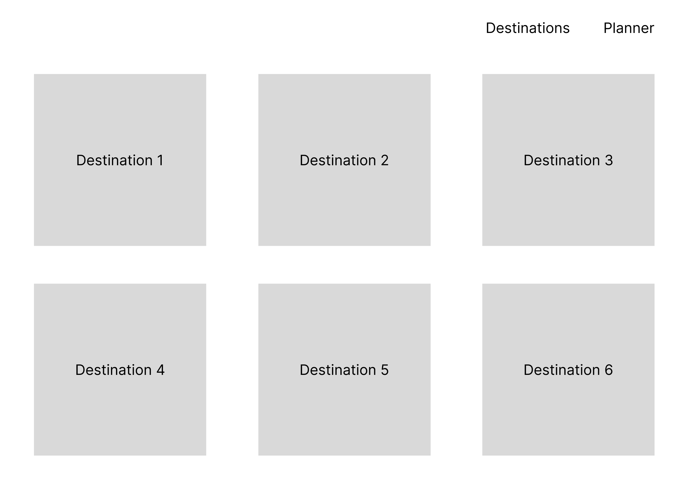
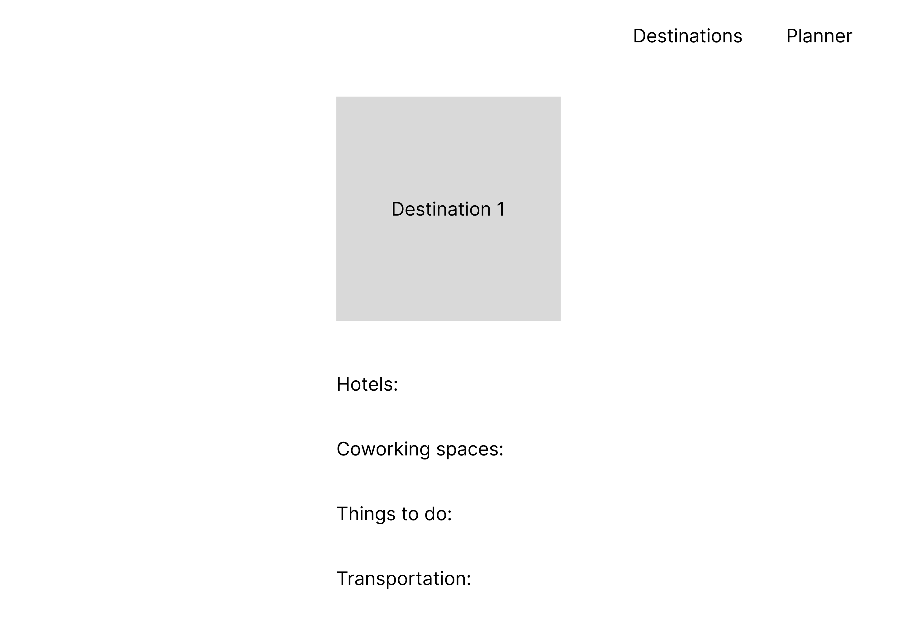
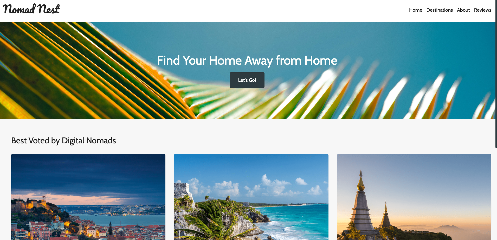
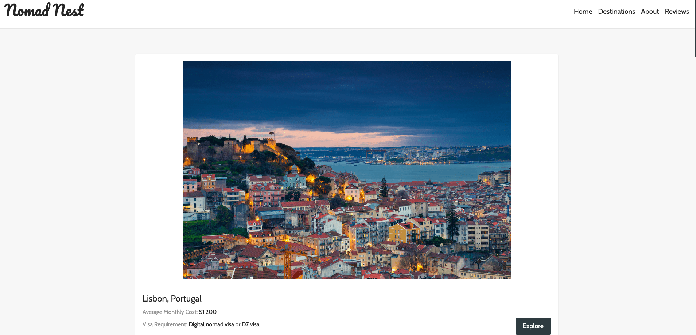
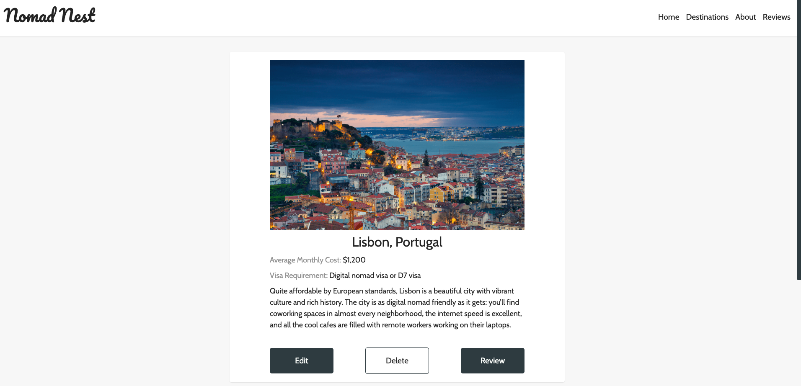
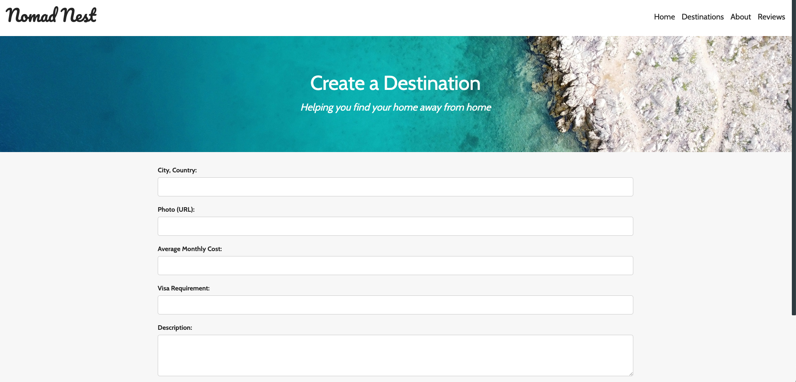
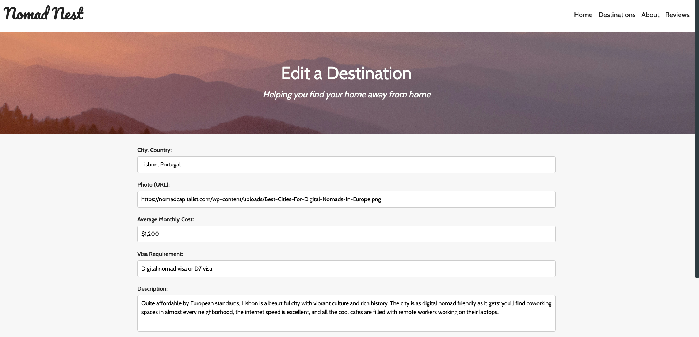
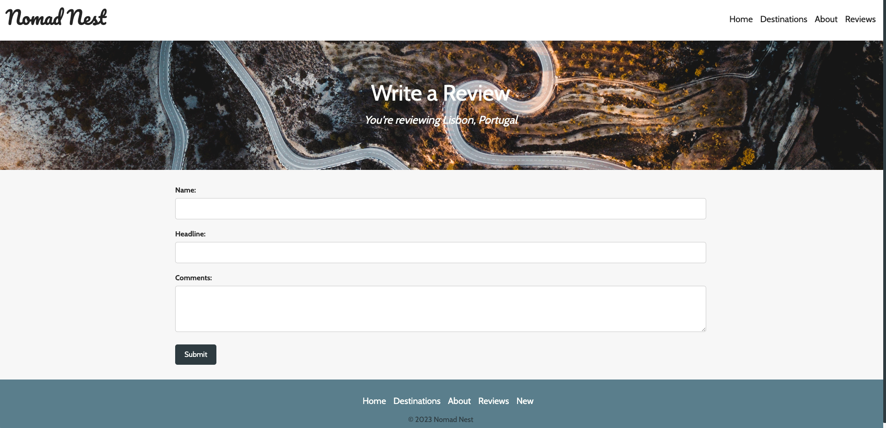
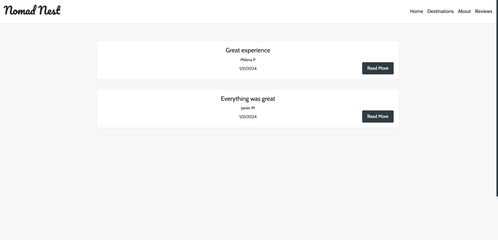
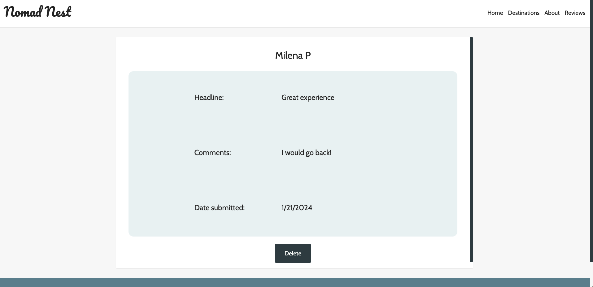

# Nomad Nest
<!-- 

 -->
| URI | REST Route | HTTP Method | CRUD Action | EJS View |
|-----|------------|-------------|-------------|----------|
| / | | GET | read | home.ejs |
| /destinations | index | GET | read | destination-index.ejs |
| /destinations/:id | show | GET | read | destination-details.ejs |
| /destinations/new | new | GET | | new-form.ejs |
| /destinations | create | POST | create | |
| /destinations/:id/edit | edit | GET | read | edit-form.ejs |
| /destinations/:id | update | PUT | update | |
| /destinations/:id | destroy | DELETE | delete | |
| /reviews/ | index | GET | read | review-index.ejs |
| /reviews/:id | show | GET | read | review-details.ejs | 
| /reviews/new/:destinationId | new | GET | read | new-form.ejs |
| /reviews/create/:destinationId | create | POST | create | |
| /reviews/:id | destroy | DELETE | delete | |
| /seed | | GET | delete & create | |

## :art: Screenshots

Wireframe-Home

Wireframe-Details

Home

Index

Show

New & Create

Edit & Update

Second Schema - Reviews

## :robot: Technologies Used

       

## :link: Links

Deployed Link

<a href="https://nomad-nest-3b3484e95287.herokuapp.com/">Nomad Nest</a>

## :rocket: Walkthrough

Welcome to Nomad Nest: a site created to assist digital nomads. Pick a location and we'll help you getting settled in your new home away from home. We'll provide and book recommended stays, assist with visa requirements, offer information about transportation, co-working spaces and more. Explore our list of destinations and find reviews posted by digital nomads. Are you ready to buckle up?

## :pencil: User Stories

- As a remote worker who likes to travel, I want to easily find recommended destinations by digital nomads like myself, along with relevant information. 
- As a remote worker who likes to travel, I want to read opinions by digital nomads who have traveled to the destinations before myself.
- As a remote worker who likes to travel, I want to share my thoughts on my experience in one of the recommended destiantions. 

<!-- ## :triangular_flag_on_post: Unsolved Problems & Hurdles

-  -->

## :dart: Next Steps

- [ ] Add logo
- [ ] Improve the look of reviews
- [ ] Add more features
